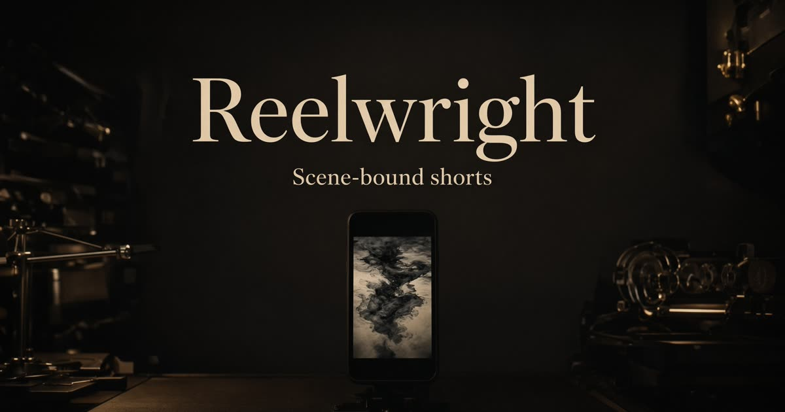

# Reelwright

<div align="center">

<p align="center">
  
</p>

<p>
  <a href="https://hermes-agent.nousresearch.com/docs/user-guide/bot-mode"></a>
  
  
  
</p>

</div>


**From a line to a short.**

Reelwright is a browser studio that turns a topic into a finished vertical video: a scene-bound script, a matching still for every spoken beat, timed voice, karaoke captions, a music bed, and a downloadable file for TikTok, Reels, or Shorts.

It is a response to [MoneyPrinterTurbo](https://github.com/harry0703/MoneyPrinterTurbo). That project is a brilliant assembly line. Its ceiling is generic stock. Footage is searched for the *topic*, not the *line*, so the picture often lies about the sentence. Reelwright is the director’s cut of the same pipeline.


## What you get

1. Type a topic — or paste your own script, one scene per line.
2. **Draft** locks a hook / point / proof / close before any shots are spent.
3. **Produce** casts a voice, shoots a still for each line, and cuts the reel.
4. Play it in a phone-shaped stage. Reshoot one scene. Revoice after an edit without regenerating images.
5. **Download** a WebM/MP4 via the browser recorder.

A sample cut (octopus: three hearts, blue blood) plays on first load so the product is visible before you spend any API calls.

## Why this instead of stock-footage printers

| MoneyPrinterTurbo | Reelwright |
| --- | --- |
| Pexels / Pixabay / Coverr for the whole topic | One still generated for **that spoken line** |
| Python, ffmpeg, Whisper, Docker | Browser. No local encoder. |
| All-or-nothing generate | Draft → edit → produce; revoice; reshoot one shot |
| Streamlit form | Phone-first cutting room |
| Random BGM folder | Quiet procedural beds (Pulse / Air / Silent) |

The honest limit: stills plus Ken Burns are not live-action clips. They *match*. Stock often doesn’t.

## Stack

- React 19, TanStack Start, Zustand, Tailwind v4
- **xAI** for the writer (`grok-4.5`), Imagine stills (`grok-imagine-image-2.0`), and TTS
- Canvas compositor: cover crop, camera moves, grain, karaoke, progress bar
- Web Audio music bed mixed into `MediaRecorder` on export
- Brief and recent topics in `localStorage` — no accounts, no database

## Quick start

```bash
git clone https://github.com/anwhelan01/reelwright.git
cd reelwright
cp .env.example .env
# put your xAI key in .env as XAI_API_KEY
npm install
npm run dev
```

Open the URL Vite prints. Without a key the sample cut still plays; Draft and Produce degrade with a clear “AI unavailable” state.

### Scripts

| Command | What |
| --- | --- |
| `npm run dev` | Dev server |
| `npm run build` | Production build |
| `npm run preview` | Serve the build |
| `npm run typecheck` | `tsc --noEmit` |
| `npm test` | Script unit tests |

### Environment

| Variable | Where | Notes |
| --- | --- | --- |
| `XAI_API_KEY` | server only | Writer, TTS, stills. Never `VITE_`-prefix it. |

Every Produce spends the key owner’s quota: 1 chat + 1 TTS + 4–6 images. Calls are user-initiated. Changing topic/style/duration redrafts; changing format reshoots; editing narration and hitting **Revoice** skips images.

## Using the studio

- **15s / 30s** — 4 or 6 scenes. Word budget is written for ~2.6 words/sec.
- **9:16 / 1:1 / 16:9** — TikTok·Reels·Shorts, feed square, landscape.
- **Styles** — Explainer, List, Story, Fact drop, How-to, Hot take.
- **Voices** — Orion, Eve, Helix, Luna, Perseus, Sirius, Altair, Rex.
- **Captions** — Karaoke (word window), Punch (hit words), Lower third.
- **Music** — Silent, Pulse, Air. Mixed under the voice on play and on export.
- **Write the script** — one scene per line; needs at least a hook, a point, and a close.
- **Space** plays/pauses when focus is not in an input.

## Pipeline

```text
topic or pasted lines
        │
        ▼
   draftScript (Grok JSON)
        │
        ├─ edit narration / caption in the cut list
        │
        ▼
   produceVoice (TTS + timestamps)
        │
        ▼
   produceSceneImage × N  (parallel, 2 at a time)
        │
        ▼
   canvas cut  →  play  →  MediaRecorder download
```

Details: [docs/ARCHITECTURE.md](docs/ARCHITECTURE.md), [docs/PIPELINE.md](docs/PIPELINE.md).

## Project layout

```text
src/
  components/studio/   phone stage, cut list, composer
  lib/generate.ts      xAI chat / TTS / images (server functions)
  lib/pipeline.ts      draft → voice → shoot orchestration
  lib/player.ts        canvas compositor
  lib/captions.ts      timestamp alignment
  lib/music.ts         Web Audio beds
  lib/store.ts         Zustand + localStorage
  lib/demo.ts          sample cut
public/demo/           sample stills + voice
```

## Credits

Inspired by [harry0703/MoneyPrinterTurbo](https://github.com/harry0703/MoneyPrinterTurbo) (MIT) and the original [MoneyPrinter](https://github.com/FujiwaraChoki/MoneyPrinter). Built with Grok.

## License

MIT. See [LICENSE](LICENSE).

---

## Hermes Bot Mode

This desk is a named [Hermes](https://hermes-agent.nousresearch.com/) Bot — own model slot, memory, skills, routines, and `@mentions`.

```bash
# once
curl -fsSL https://hermes-agent.nousresearch.com/install.sh | bash

# this repo
./scripts/install-hermes-bot.sh
hermes -p reelwright chat
```

In Hermes Desktop the Bot lands under **Bots**. Type `@reelwright` from any chat; group it with the rest of the k3ss roster (`studio`).

| File | Role |
| --- | --- |
| [`AGENTS.md`](AGENTS.md) | Project harness Hermes loads at session start |
| [`.hermes/SOUL.md`](.hermes/SOUL.md) | Bot personality |
| [`.hermes/bot.yaml`](.hermes/bot.yaml) | Roster, skills, groups |
| [`.hermes/skills/reelwright/SKILL.md`](.hermes/skills/reelwright/SKILL.md) | Portable skill |

Docs: [Bot Mode](https://hermes-agent.nousresearch.com/docs/user-guide/bot-mode) · [Context files](https://hermes-agent.nousresearch.com/docs/user-guide/features/context-files) · [Skills](https://hermes-agent.nousresearch.com/docs/user-guide/features/skills)
